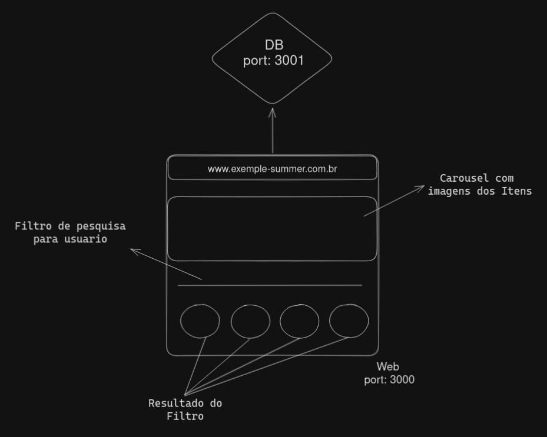

<br />

## Resumo
O teste consiste basicamente em fazer uma pagina web (port: 3000) que se comunica com uma API (port: 3001) para consumir os produtos e assim gerar uma pagina para que usuarios possam consultar e adquirir os produtos.

## Durante o Desenvolvimento
O uso de framework CSS é livre e tambem deixamos a criterio do desenvolvedor se irá usar Axios ou Fetch. Será analisado a forma que o desenvolvedor pensa, portanto adotar as praticas de Clean Code será um diferencial. Como empresa que zela em manter codigos organizados e limpos, separamos algumas dicas:
1. Evitar o uso de `let` ou `var`
2. Adotar sempre que possivel `Arrow Functions`
3. Functions podem ser usadas muitas vezes!
4. Evitar o uso de `Ifs` e `Elses` (Valorizamos desenvolvedores que tem conhecimento em multiplas formas de validação)

No diretório Frontend ja deixamos pronto o seu `Dockerfile` para buildar sua imagem e deixamos comentado no `Docker Compose` a criação do container do Front da aplicação.

Sabemos que, as vezes, as ideias de layout de Pagina Web pode ser um desafio. Por isso resolvemos disponibilizar algo que esperamos:



Mas ficaremos muito mais contentes se você nos mostrasse a sua propria soluções!!

**ATENÇÃO!! Consideremos, e fazemos, o uso do ChatGPT para pesquisas rápidas, cuidado com o uso excessivo pois iremos querer conversar mais sobre o codigo que nos será entregue.**

## Stacks:
### Requisitos para o teste:
- JavaScript com o uso de ReactJs
- Conhecimento basico de NodeJs
- Docker
- Ciclo de vida
- Git

### Desejavel
- PHP
- CSS
- Frameworks de CSS:
  - Bootstrap
  - Tailwind
- GitHub workflow
- Kanban

<hr />

### Iniciando o Projeto
1. Clone o projeto:
```
git clone git@github.com:Summer-Developer-Team/Test-Dev-Jr.git
```
2. Entre no diretório e instale as dependências:
```
cd Test-Dev-Jr && npm install
```
3. Suba a API
```
npm rum compose
```

<hr />

### EndPoints:
### Get All Products
```
product/
```
### Get Products by ID 
```
product/id
```
### Get Products by Name
```
product/search?q=<str_to_search>
```
